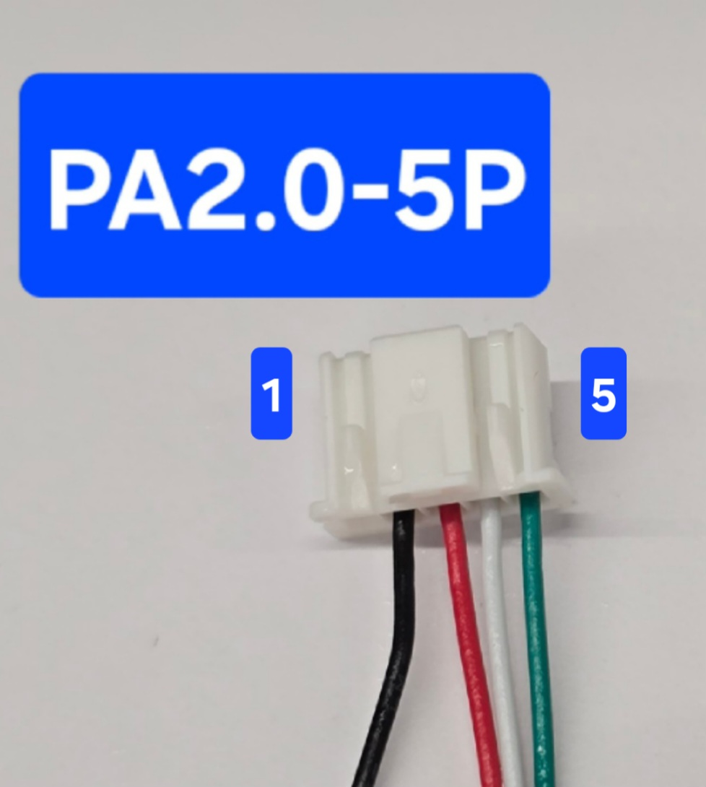

# MitsubishiCN105ESPHome

This is a customized version of [echavet/MitsubishiCN105ESPHome](https://github.com/echavet/MitsubishiCN105ESPHome).  
It includes ESPHome YAML configurations targeting the ESP32-C3 platform, along with usage notes for integrating Mitsubishi HVAC systems via CN105.

## 三菱電機冷氣ESPhome

這是個使用ESP32C3搭配ESPhome來控制三菱電機冷氣的專案，可適用壁掛及吊隱式冷氣

**適用型號: 需拆開機殼找出機板上有個紅色寫著CN105接頭，有這個就能控制** 

- - -

### 已測試型號OK(歡迎回報):

**吊隱式:** `SEZ-M**DAL-TW`,  `SEZ-KD**VA(L)`

**壁掛型:** `MSZ-GR**NJ`, `MSZ-HT**NF`

CN105是**白色**接頭的型號: `MSZ-HT**NF`

- - -

(搜尋[mitsubishi cn105](https://www.google.com/search?sca_esv=5b070172e01c51df&sxsrf=AE3TifNxQjLFcJ7dliwfM1pfAhlKMd25Ig:1752415035350&q=mitsubishi+cn105&udm=2&fbs=AIIjpHybaGNnaZw_4TckIDK59Rtx4FbWz8M1G9nQGNKSn1ac4RwxWEIVsDCHTtcX7EMisKPo2x-K2YXHUvoNp-hb6MFkGu7L2620ab6wOvo0TrapbKMy6BQ9l9X11pf1caiFRuttLPEFGW0_zf8EDjZOd7O4Z9HxiH3J782Mw7yZTOfQl9wIoHJgELWDXXeB0rUi_pSHkuYE&sa=X&ved=2ahUKEwillrnd_rmOAxWbaPUHHRdGJeEQtKgLKAJ6BAgVEAE&biw=1792&bih=856&dpr=2.14)可以看到更多CN105插座所在圖)

`climate-mt.factory.bin`適用USB線直接燒錄，想自行修改YAML請參考`ESP32C3-example.yaml`

YAML修改基本上只要修改最頂端的名稱即可，方便OTA與辨識是哪一台，也可將用不到的實體註解掉

`climate-mt.ota.bin`僅供燒錄過OTA更新用

## 如何下載

點擊檔案名稱>點右上角有個下載的圖案(Download Raw file)>儲存

## 使用方法

### A. 透過USB

1. 模組透過usb接上電腦
2. 用chrome或edge瀏覽器前往 [https://web.esphome.io](https://web.esphome.io/)
3. 按Connect>選擇寫USB JTAG>按INSTALL>選擇剛儲存的Bin檔，等待燒錄完成
4. 顯示finish後，就可看到ESP32上面的藍燈開始閃爍，這時候等待久一點，會看到有熱點跑出來
5. 點連線並輸入Wi-Fi密碼: 12345678
6. 連上後輸入http://192.168.4.1
7. 進到網頁選擇家中Wi-Fi名稱及輸入密碼後按儲存，連上後HA應該就會自動發現此裝置

### B. OTA

1. 在瀏覽器網址列輸入裝置IP
2. 最下方OTA Update選擇ota.bin檔>按Update，等待畫面跳轉為done即完成

## 硬體架構

### 硬體需求

1. ESP32C3 super mini
2. 5V to 3.3V level shifter (推薦使用)
3. PA2.0-5P female for CN105

### 排線接法

參考自[SwiCago/HeatPump README](https://github.com/SwiCago/HeatPump/blob/master/README.md#demo-circuit)

| Pin | CN105 | ESP32C3
|-------|:-----:|:-----:|
| 1 | 12V(不用接) | 不用接 |
| 2 | GND | GND |
| 3 | 5V | 5V |
| 4 | TX | RX(GPIO6) |
| 5 | RX | TX(GPIO7) |

PA2.0-5P 排線Pin順序:

**※ESP32C3的TX, RX接到冷氣間可對接，但推薦使用5V to 3.3V level shifter，避免傷及ESP32C3的GPIO或傳輸不穩定**

## 📦 Credits
This project is based on the excellent work of [echavet/MitsubishiCN105ESPHome](https://github.com/echavet/MitsubishiCN105ESPHome), which itself integrates multiple community contributions.  
Licensed under MIT.
